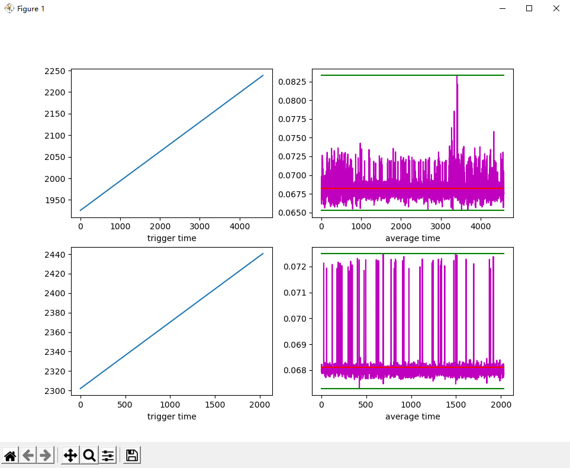

# README

使用Python3 matplotlib绘图，直观显示内核Log时间信息，便于分析内核log，主要是对内核输出的log进行时间分析工具

## 参考文档

* [README.md](docs/README.md)

## 安装依赖包

* pip3 install matplotlib

## 示例

* 左图：采样点时间轨迹，可以看采样Timer是否大体工作正常，不会出现太大延迟，内核调度正常
* 右图：
  * 紫色：实际采样间隔
  * 绿色：采样最大、最小间隔波动
  * 红色：采样平均间隔

