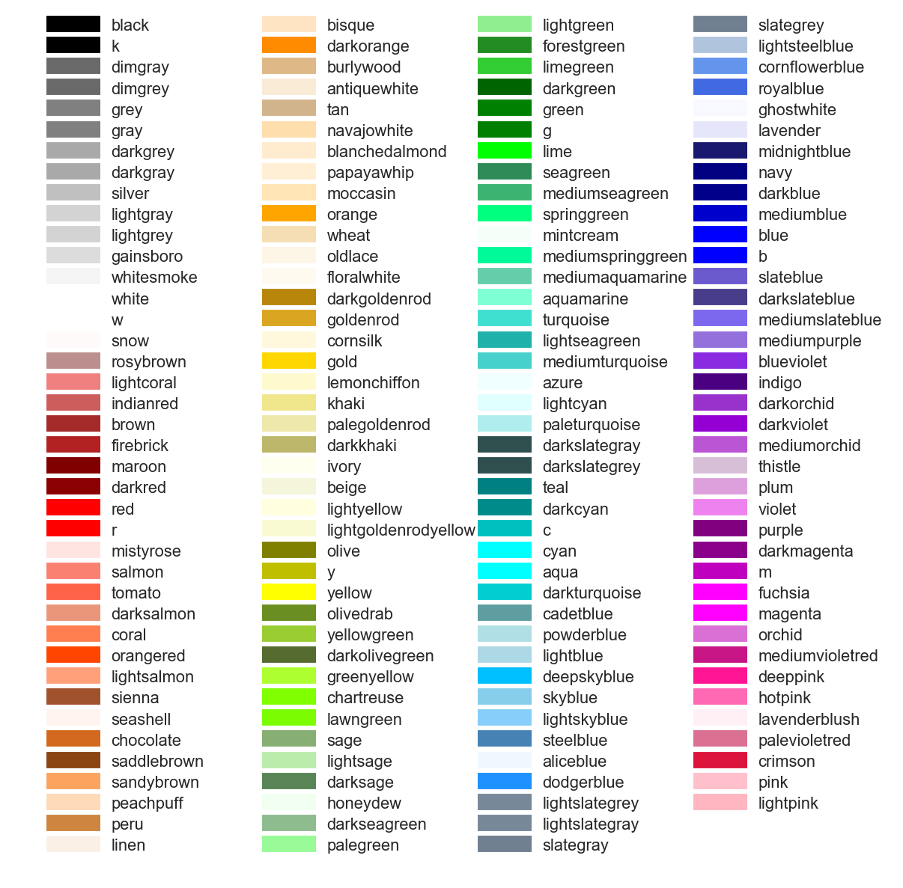

# README

## 参考颜色




* frameworks/base/core/java/android/hardware/SystemSensorManager.java
  * frameworks/base/core/java/android/hardware/SensorManager.java
    ```Java
    //...省略
    
    @SystemService(Context.SENSOR_SERVICE)
    public abstract class SensorManager {
    
        //...省略
    
        /** get sensor data as fast as possible */
        public static final int SENSOR_DELAY_FASTEST = 0;
        /** rate suitable for games */
        public static final int SENSOR_DELAY_GAME = 1;
        /** rate suitable for the user interface  */
        public static final int SENSOR_DELAY_UI = 2;
        /** rate (default) suitable for screen orientation changes */
        public static final int SENSOR_DELAY_NORMAL = 3;
    
        //...省略
    
        private static int getDelay(int rate) {
            int delay = -1;
            switch (rate) {
                case SENSOR_DELAY_FASTEST:
                    delay = 0;
                    break;
                case SENSOR_DELAY_GAME:
                    delay = 20000;
                    break;
                case SENSOR_DELAY_UI:
                    delay = 66667;
                    break;
                case SENSOR_DELAY_NORMAL:
                    delay = 200000;
                    break;
                default:
                    delay = rate;
                    break;
            }
            return delay;
        }
    
        //...省略
    
    }
    
    //...省略
    ```


```diff
diff --git a/kernel-4.9/drivers/misc/mediatek/sensors-1.0/alsps/alsps.c b/kernel-4.9/drivers/misc/mediatek/sensors-1.0/alsps/alsps.c
index e33fd4f11b8..6a4652542ce 100755
--- a/kernel-4.9/drivers/misc/mediatek/sensors-1.0/alsps/alsps.c
+++ b/kernel-4.9/drivers/misc/mediatek/sensors-1.0/alsps/alsps.c
@@ -284,7 +284,7 @@ static struct alsps_context *alsps_context_alloc_object(void)
                return NULL;
        }
        atomic_set(&obj->delay_als,
-                  200); /*5Hz, set work queue delay time 200ms */
+                  300); /*5Hz, set work queue delay time 200ms */
        atomic_set(&obj->delay_ps,
                   200); /* 5Hz,  set work queue delay time 200ms */
        atomic_set(&obj->wake, 0);
```

